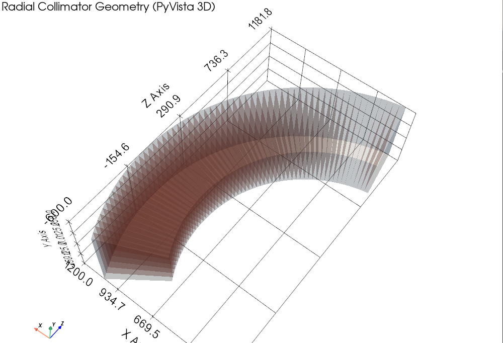
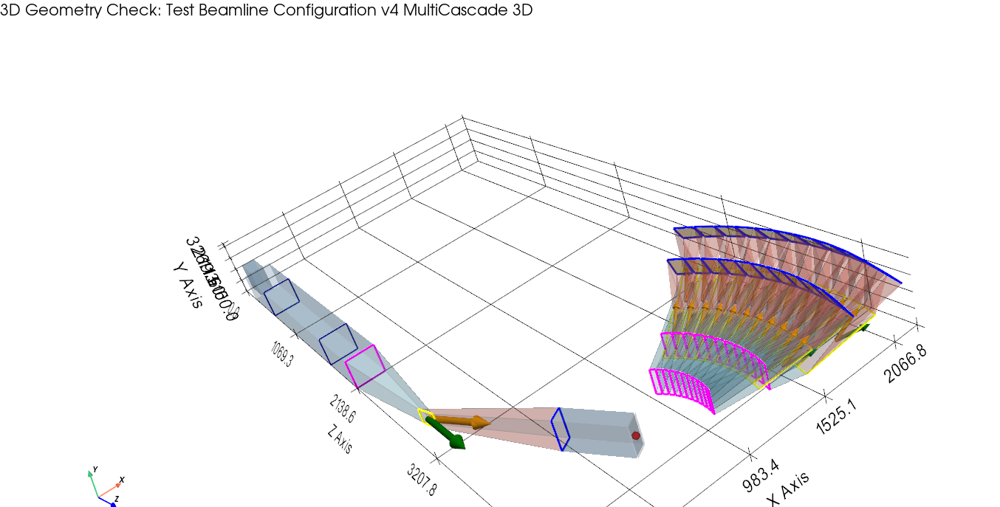

# pyneutrace: Neutron Ray Tracing Python Package

`pyneutrace` is a pure-Python Monte Carlo neutron ray-tracing package for building virtual neutron instruments, tracing large ray batches with vectorized `numpy` kernels, and analyzing beam transport, Bragg selection, sample scattering, and detector response.

The current codebase supports both single-component studies and assembled beamlines with 3D geometry export, analyzer cascades, multichannel analyzer banks, checkpointed downstream re-runs, and SciPy-based instrument optimization.

---

## Features

- **Vectorized Monte Carlo Transport**: traces large neutron batches with `numpy` arrays and component-level `propagate_TOF()` kernels.
- **Instrument Assembly**: uses `InstrumentAssemble` to connect optics, samples, analyzers, monitors, and helper stages through consistent 4x4 transforms.
- **3D Geometry Rendering**: components expose `get_mesh_pipeline()` so assembled instruments can be visualized with PyVista through `InstrumentAssemble.visualize_3d()`.
- **Analyzer Stack**: includes `Analyzer`, `VAnalyzer`, `CascadeAnalyzer`, and `MultiCascadeAnalyzer` for single-analyzer, vertical-analyzer, cascade, and multichannel bank studies.
- **Built-in Diagnostics**: analyzers now expose lightweight `exit_capture` datasets for downstream plotting and debugging without embedding physical monitor logic.
- **Checkpoint / Resume Workflow**: `ExportRays` and `ImportRays` support staged simulations for strongly attenuating beamlines.
- **Optimization Support**: `InstrumentOptimizer` registers component parameters, maps them into optimization vectors, and evaluates objective functions over an assembled beamline.
- **Plotting Utilities**: `InstrumentSimPlot` provides transmission summaries and virtual-monitor-style beam snapshots at any stage.

---

## Package Layout

```text
pyneutrace/
├── src/
│   └── pyneutrace/
│       ├── constants.py
│       ├── utils.py
│       ├── components/
│       ├── instrument/
│       ├── simulation/
│       └── visualization/
├── test/
├── pyproject.toml
└── README.md
```

- `components/`: sources, guides, choppers, analyzers, samples, collimators, monitors, and helper components
- `instrument/`: assembled beamline execution and 3D geometry handling
- `simulation/`: parameter registration and optimization via `InstrumentOptimizer`
- `visualization/`: Matplotlib-based result summaries
- `test/`: example scripts and regression tests covering component and beamline workflows

---

## Installation

Install the package from PyPi:

```bash
pip install pyneutrace
```
Please check the details on the PyPi webpage:
[pyneutrace](https://pypi.org/project/pyneutrace/)

For 3D geometry rendering, ensure PyVista is available in your environment.

---

## Quick Start

```python
from pyneutrace.components import NSource, Spacer, NeutronGuide, Monitor
from pyneutrace.instrument.instrumentassemble import InstrumentAssemble

beamline = InstrumentAssemble(name="Simple Beamline")
beamline.add_component("Source", NSource(entry_w=40, entry_h=40, exit_w=40, exit_h=40, length=100))
beamline.add_component("Spacer", Spacer(entry_w=40, entry_h=40, exit_w=40, exit_h=40, length=500))
beamline.add_component("Guide", NeutronGuide(entry_w=40, entry_h=40, exit_w=30, exit_h=30, length=2000))
beamline.add_component("Monitor", Monitor(half_w=15, half_h=15))

pos, vel, time, weight = beamline.run(num_rays=100000)
beamline.print_summary()
```

Useful follow-up operations:

- `beamline.run_until("Guide", ...)`: stop at an intermediate stage
- `beamline.get_history()`: inspect per-stage transmission history
- `beamline.visualize_3d()`: render the assembled geometry
- `InstrumentSimPlot.plot_transmission_summary(beamline)`: plot transmission from `history_log`

---

## Main Public API

### Components (`pyneutrace.components`)

#### Sources

| Class | Description |
|---|---|
| `NeutronSource` | Continuous source with a reactor-style spectral model. |
| `NSource` | Geometric source used heavily in test and beamline assembly workflows. |
| `Moderator` | Pulsed source with time structure for TOF studies. |

#### Beam Transport

| Class | Description |
|---|---|
| `Spacer` | Empty-space propagation between physical components. |
| `NeutronGuide` | Straight or tapered guide. |
| `CurvedGuide` | Horizontally curved guide / bender. |
| `SingleEllipticGuide` | Single elliptic focusing guide. |
| `DoubleEllipticGuide` | Double elliptic focusing guide. |
| `DoubleParabolicGuide` | Double parabolic guide. |
| `Soller` | Linear collimator. |
| `RadCollimator` | Radial collimator for sample-centred scattered beams. |

#### Choppers And Selectors

| Class | Description |
|---|---|
| `DiskChopper` | Rotating disk chopper. |
| `StraightFermiChopper` | Straight-slit Fermi chopper. |
| `CurvedFermiChopper` | Curved Fermi chopper. |
| `VelSelector` | Mechanical velocity selector. |

#### Bragg Optics

| Class | Description |
|---|---|
| `Monochromator` | Single Bragg optic in the primary beam. |
| `Analyzer` | Analyzer wrapper built on the monochromator-style geometry. |
| `VAnalyzer` | Vertical analyzer with sample-centred branch support and explicit entry/exit transforms. |
| `CascadeAnalyzer` | Ordered list of `VAnalyzer` stages sharing the same branch frame. |
| `MultiCascadeAnalyzer` | Bank of horizontal channels, each containing a `CascadeAnalyzer`. |

#### Samples

| Class | Description |
|---|---|
| `VRodSample` | Simple rod sample / isotropic elastic scattering example. |
| `PowderSample` | Powder diffraction sample with CIF-based crystallography support. |
| `SingleCrystalSample` | Single-crystal scattering component. |

#### Monitors And Helper Stages

| Class | Description |
|---|---|
| `Monitor` | Flat passive monitor in a planar exit frame. |
| `CylindMonitor` | Cylindrical PSD-style monitor in a sample-centred geometry. |
| `VirtualFilterAndMultiplier` | Statistical helper stage for band filtering and multiplicative resampling. |
| `ExportRays` / `ImportRays` | Ray checkpointing and downstream resume utilities. |

### Instrument Assembly (`pyneutrace.instrument`)

| Class | Description |
|---|---|
| `InstrumentAssemble` | Pipeline manager that stores components, builds transforms, executes `run()` / `run_until()`, maintains `history_log`, and renders 3D geometry. |

Core methods on `InstrumentAssemble`:

- `add_component(name, obj, transform=None, auto_chain=True)`
- `run(initPos=None, initVel=None, initTime=None, initWeight=None, num_rays=None)`
- `run_until(stage_name_or_index, ...)`
- `get_history()`
- `print_summary()`
- `visualize_3d(show_edges=False)`

### Optimization (`pyneutrace.simulation`)

| Class | Description |
|---|---|
| `InstrumentOptimizer` | Parameter-registry-based optimizer that registers component attributes, evaluates objective functions, and calls SciPy minimizers / differential evolution. |

Typical `InstrumentOptimizer` workflow:

1. Build an `InstrumentAssemble` pipeline.
2. Register tunable parameters with bounds using `register_parameter(...)`.
3. Define a scalar objective over `(pos, vel, time, weight)`.
4. Call `evaluate_once(...)` or `optimize(...)`.

### Visualization (`pyneutrace.visualization`)

| Class | Description |
|---|---|
| `InstrumentSimPlot` | Matplotlib helpers for transmission summaries and virtual-monitor-style stage inspection. |

---

## Analyzer Diagnostics

`Analyzer` and `VAnalyzer` now provide an `exit_capture` dataset after propagation.

- Default mode: `exit_capture_mode="position"`
- Optional mode: `exit_capture_mode="full"`

In `position` mode, `exit_capture` stores:

- `x`
- `y`
- `z`
- `weight`

In `full` mode, it also stores:

- `vx`
- `vy`
- `vz`
- `time`

Higher-level analyzer containers expose this automatically:

- `CascadeAnalyzer.stage_results[i]["exit_capture"]`
- `MultiCascadeAnalyzer.channel_results[i]["stage_results"][j]["exit_capture"]`

This is intended for plotting and diagnostics without requiring embedded monitor components at every analyzer exit.

---

## Coordinate And Geometry Model

### Global Convention

```text
X : horizontal
Y : vertical
Z : nominal local beam direction
```

### Entry / Exit Frames

Most transport components define:

- an entry frame, typically with the beam crossing `z = 0`
- an exit frame published through `T_exit_from_entry`

`InstrumentAssemble` uses these transforms to connect components back-to-back in a continuous beamline. If physical drift space is needed, insert a `Spacer`.

### Sample-Centred Branches

Scattering components are the main exception to the simple planar chaining rule. After a sample, downstream components may use a sample-centred frame rather than a single exit plane. This is especially important for:

- `RadCollimator`
- `CylindMonitor`
- `VAnalyzer`
- `CascadeAnalyzer`
- `MultiCascadeAnalyzer`

These components support sample-centred transport and branch geometry explicitly.

Here are two examples:



### 3D Geometry Export

Physical components implement `get_mesh_pipeline()`, returning standardized items such as:

- `structured_grid`
- `polyline`
- `polyline_loop`
- `arrow`

`InstrumentAssemble.visualize_3d()` transforms these local meshes into global coordinates and renders them with PyVista.

---

## Notes On Current Scope

- Gravity is not included; neutrons travel in straight-line segments between component interactions.
- Detector efficiency models are still simplified; monitors act as idealized capture surfaces.
